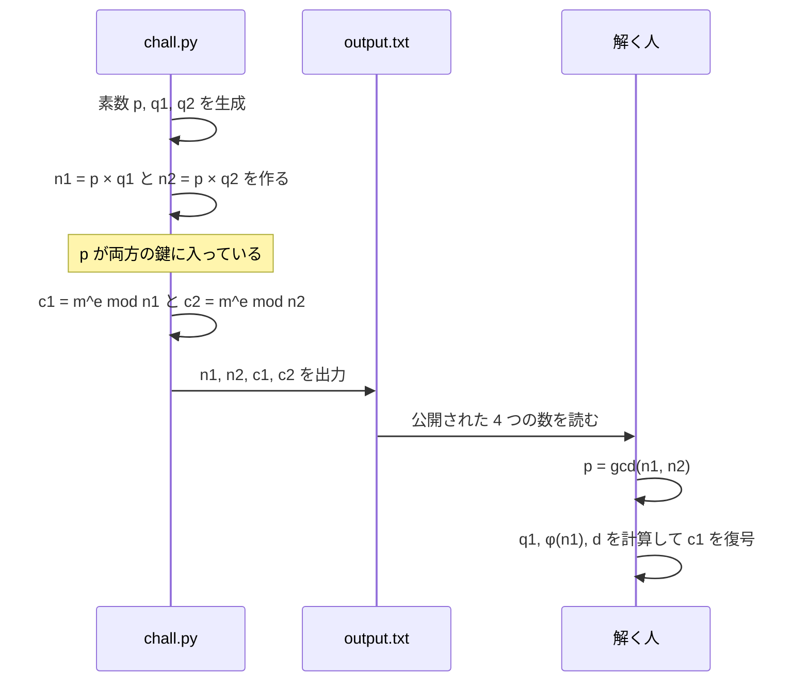
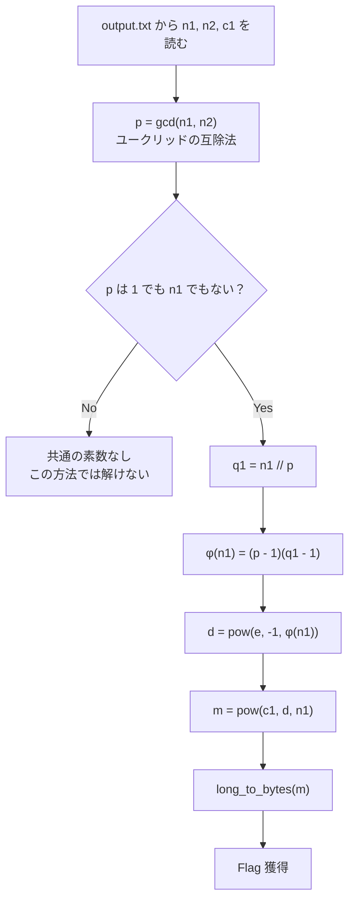

> [!IMPORTANT]
> **Solved with Gemini in Colab**
>
> この問題は Google の AI コーディングアシスタント **Gemini in Colab** を活用して解決されました。

> [!NOTE]
> この Writeup は AI により自動生成されています。 本ドキュメントは、AI アシスタントを用いて作成された Writeup です。記載内容は解法の一例であり、内容の正確性については十分にご確認の上ご利用ください。

# Shared Prime

## 概要
*   **カテゴリー**: Crypto
*   **トピック**: RSA
*   **難易度**: Medium 3.5
*   **問題リンク**: [Shared Prime - Daily AlpacaHack](https://alpacahack.com/daily/challenges/shared-prime)

## 使用ツール
*   **Python 3**: 解法スクリプトの実装
*   **math**: `math.gcd` による最大公約数の計算（Python 標準ライブラリ）
*   **pycryptodome**: `Crypto.Util.number.long_to_bytes` による整数 → バイト列の変換（`pip install pycryptodome`）
*   **Gemini in Colab**: 配布ファイルの解析およびコード生成

## 問題の分析
本問題は、**Daily AlpacaHack** の RSA 問題です。問題文は「simple!」の一言だけで、配布ファイルは次の 2 つです。

| ファイル | 内容 |
| :--- | :--- |
| `chall.py` | フラグを RSA で 2 回暗号化するスクリプト |
| `output.txt` | `chall.py` の実行結果（`n1`, `n2`, `c1`, `c2` の 4 つの整数） |

`chall.py` の中身は次の通りです。

```python
import os

from Crypto.Util.number import bytes_to_long, getPrime


FLAG = os.environ.get("FLAG", "Alpaca{DUMMY}").encode()
e = 65537

p = getPrime(1024)
q1 = getPrime(1024)
q2 = getPrime(1024)

n1 = p * q1
n2 = p * q2
m = bytes_to_long(FLAG)
assert m < min(n1, n2)

c1 = pow(m, e, n1)
c2 = pow(m, e, n2)

print(f"{n1 = }")
print(f"{n2 = }")
print(f"{c1 = }")
print(f"{c2 = }")
```

1024 ビットの素数を 3 つ（$`p, q_1, q_2`$）作り、**2 つの公開鍵 $`n_1 = p q_1`$ と $`n_2 = p q_2`$ の両方に同じ素数 $`p`$ を使っています**。これが問題名「Shared Prime（共有された素数）」の意味です。

| 変数 | 意味 | 公開されているか | 今回の値の大きさ |
| :--- | :--- | :---: | :--- |
| $`p`$ | 2 つの鍵で共有されている素数 | ❌ | 1024 ビット |
| $`q_1`$, $`q_2`$ | それぞれの鍵だけが持つ素数 | ❌ | 各 1024 ビット |
| $`n_1`$, $`n_2`$ | 公開鍵の法（モジュラス） | ✅ | 各 2047 ビット（10 進 617 桁） |
| $`e`$ | 公開指数 `65537` | ✅（`chall.py` に記載） | 17 ビット |
| $`c_1`$, $`c_2`$ | 同じフラグ $`m`$ の暗号文 | ✅ | — |

※ ビット数・桁数は、配布された `output.txt` から solve.py で実際に計算した値です。

`chall.py` が `output.txt` を作るまでの流れを図にすると次のようになります。



## 脆弱性の詳細

### RSA のおさらい
RSA は次のように鍵を作り、暗号化・復号します（$`p, q`$ は異なる素数）。

```math
\begin{aligned}
n &= p\,q \\
\varphi(n) &= (p-1)(q-1) \\
e\,d &\equiv 1 \pmod{\varphi(n)} \\
c &= m^{e} \bmod n \quad \text{(encrypt)} \\
m &= c^{d} \bmod n \quad \text{(decrypt)}
\end{aligned}
```

公開されるのは $`(n, e)`$ だけです。秘密鍵 $`d`$ を作るには $`\varphi(n)`$、つまり $`n`$ の素因数 $`p, q`$ が必要です。2047 ビット級の $`n`$ を素因数分解するのは現実的に不可能なので、RSA は安全とされています。

### なぜ gcd で共有素数 p が求まるのか
今回は $`n_1`$ と $`n_2`$ が同じ素数 $`p`$ を含んでいます。最大公約数の性質 $`\gcd(ka, kb) = k \cdot \gcd(a, b)`$ を使うと、

```math
\begin{aligned}
\gcd(n_1, n_2) &= \gcd(p\,q_1,\ p\,q_2) \\
&= p \cdot \gcd(q_1, q_2) \\
&= p \cdot 1 \qquad (q_1 \neq q_2 \text{ are distinct primes}) \\
&= p
\end{aligned}
```

となり、**素因数分解をしなくても、最大公約数を計算するだけで $`p`$ が出てきます**。実際に `output.txt` の値で計算すると、$`\gcd(n_1, n_2)`$ は 1024 ビットの素数になり、$`n_1`$ も $`n_2`$ も割り切ります。

> [!TIP]
> 最大公約数は **ユークリッドの互除法** で高速に求められます。
>
> ```math
> \gcd(a, b) = \gcd(b,\ a \bmod b), \qquad \gcd(a, 0) = a
> ```
>
> 1 回ごとに数がどんどん小さくなるため、繰り返し回数は桁数に比例する程度で済みます。今回の $`n_1, n_2`$ で互除法をそのまま実装して数えると、**625 回** の剰余計算（割り算の余りを求める操作）で $`p`$ にたどり着きました。

| 処理 | 必要な計算 | 2047 ビットの $`n`$ に対して |
| :--- | :--- | :--- |
| 素因数分解（$`n_1`$ だけから $`p`$ を求める） | 既知の最良アルゴリズムでも膨大 | 現実的に不可能 |
| 最大公約数（$`n_1, n_2`$ の両方から $`p`$ を求める） | ユークリッドの互除法 | 一瞬（今回は 625 回の割り算） |

### p から秘密鍵 d を作る
$`p`$ が分かれば、あとは鍵を作った本人と同じ計算ができます。

```math
\begin{aligned}
q_1 &= n_1 / p \\
\varphi(n_1) &= (p-1)(q_1-1) \\
d &= e^{-1} \bmod \varphi(n_1) \\
m &= c_1^{\,d} \bmod n_1
\end{aligned}
```

$`d`$ は $`e`$ の $`\varphi(n_1)`$ を法とする逆元で、$`\gcd(e, \varphi(n_1)) = 1`$ のときだけ存在します。今回の値で実際に確かめると $`\gcd(e, \varphi(n_1)) = 1`$ だったので、Python の `pow(e, -1, phi)` でそのまま計算できます。

最後に、`chall.py` は `bytes_to_long` でフラグを整数 $`m`$ にしてから暗号化しているので、`long_to_bytes(m)` で元の文字列に戻せばフラグが得られます。

<details>
<summary>📐 補足: なぜ c<sup>d</sup> mod n で元に戻るのか（クリックで展開）</summary>

$`e\,d \equiv 1 \pmod{\varphi(n)}`$ なので、ある整数 $`k \ge 0`$ を使って $`e\,d = 1 + k\,\varphi(n)`$ と書けます。$`\gcd(m, n) = 1`$ のとき、オイラーの定理 $`m^{\varphi(n)} \equiv 1 \pmod{n}`$ より

```math
\begin{aligned}
c^{d} &\equiv (m^{e})^{d} = m^{e d} \\
&= m^{1 + k\,\varphi(n)} \\
&= m \cdot \left(m^{\varphi(n)}\right)^{k} \\
&\equiv m \cdot 1^{k} = m \pmod{n}
\end{aligned}
```

となります（$`m`$ が $`p`$ や $`q`$ の倍数の場合も、中国剰余定理を使って $`p`$ と $`q`$ それぞれを法として考えると同じ結論になります）。

さらに `chall.py` の `assert m < min(n1, n2)` により $`0 \le m < n_1`$ が保証されているので、$`c^{d} \bmod n_1`$ の結果はちょうど $`m`$ そのものになります。

</details>

### 攻撃フロー


> [!TIP]
> 2 本目の鍵 $`(n_2, c_2)`$ でも同じことができます。$`q_2 = n_2 / p`$ から $`\varphi(n_2) = (p-1)(q_2-1)`$ を作って $`c_2`$ を復号すると、$`c_1`$ から得たものと同じ $`m`$ になります。solve.py ではこれを確認用に表示しています。

> [!WARNING]
> 「鍵どうしで素数がかぶる」のは CTF の中だけの話ではありません。2012 年の研究（Heninger らの *Mining Your Ps and Qs* など）では、乱数生成の不備により、インターネット上の多数の TLS / SSH 公開鍵が素数を共有しており、gcd で秘密鍵が復元できてしまうことが報告されています。RSA の素数は、鍵ごとに十分な乱数から独立に生成する必要があります。

## 用語解説
*   **RSA**: 大きな数の素因数分解が難しいことを安全性の根拠とする公開鍵暗号です。公開鍵 $`(n, e)`$ で暗号化し、秘密鍵 $`d`$ で復号します。
*   **素数 / 素因数分解**: 1 と自分自身でしか割り切れない 2 以上の整数が素数です。整数を素数の積に分解することを素因数分解といい、巨大な数では非常に時間がかかります。
*   **最大公約数（gcd）**: 2 つの整数を両方とも割り切る最大の整数です。$`\gcd(12, 18) = 6`$ のように書きます。
*   **ユークリッドの互除法**: 「大きい方を小さい方で割った余り」に置き換える操作を繰り返して gcd を求める方法です。素因数分解をせずに、巨大な数でも高速に計算できます。
*   **オイラーのトーシェント関数 $`\varphi(n)`$**: $`1`$ 以上 $`n`$ 以下で $`n`$ と互いに素な整数の個数です。$`n = pq`$（$`p \neq q`$ は素数）なら $`\varphi(n) = (p-1)(q-1)`$ です。
*   **モジュラ逆元**: $`e\,d \equiv 1 \pmod{\varphi}`$ を満たす $`d`$ のことです。Python 3.8 以降では `pow(e, -1, phi)` で求められます。
*   **公開指数 $`e = 65537`$**: $`65537 = 2^{16} + 1`$ は素数で、RSA で最もよく使われる公開指数です。
*   **`bytes_to_long` / `long_to_bytes`**: pycryptodome の関数で、バイト列とそれを big-endian で読んだ整数を相互に変換します。RSA は整数しか扱えないため、文字列を一度整数にしてから暗号化します。

## 解決スクリプト
[solve.py を参照してください](./solve.py)

```bash
pip install pycryptodome
python3 solve.py ./shared-prime/output.txt
```

配布ファイル（`shared-prime.tar.gz`）は問題ページから各自ダウンロードし、展開してから実行してください。
